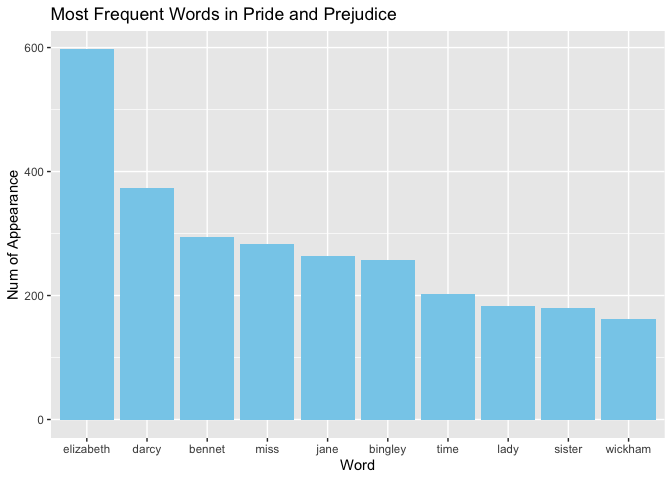

assignmentb4
================
Julia
2023-11-29

# Load Libraries

``` r
library(janeaustenr)
library(dplyr)
```

    ## 
    ## Attaching package: 'dplyr'

    ## The following objects are masked from 'package:stats':
    ## 
    ##     filter, lag

    ## The following objects are masked from 'package:base':
    ## 
    ##     intersect, setdiff, setequal, union

``` r
library(tidytext)
library(ggplot2)
library(testthat)
```

    ## 
    ## Attaching package: 'testthat'

    ## The following object is masked from 'package:dplyr':
    ## 
    ##     matches

# Exercise 1

For exercise 1, I will choose **Pride and Prejudice** from
**janeaustenr** package.

``` r
# Read the text of "Pride and Prejudice" and break text into words
pride_prejudice_text <- tibble(text = prideprejudice)
words <- pride_prejudice_text %>%
  unnest_tokens(word, text)

# Remove stop words
clean_words <- words %>%
  anti_join(stop_words, by = "word")

# Count frequency of each word
word_with_count <- clean_words %>%
  count(word, sort = TRUE)

# Plot the most frequent words
ggplot(word_with_count[1:10, ], aes(x = reorder(word, -n), y = n)) +
  geom_bar(stat = "identity", fill = "skyblue") +
  labs(title = "Most Frequent Words in Pride and Prejudice",
       x = "Word",
       y = "Num of Appearance")
```

<!-- -->

# Exercise 2

In my pig latin algorithm, I modified the original algorithm to
something as follows: 1. For words that end with consonant sounds, all
letters after the last vowel are placed at the beginning of the word
sequence. 2. For words ending with vowel sounds, remove the last
vowel(s) 3. After modification, “YAY” will be added to the end of the
word

``` r
#' Funtion of Converting to My Pig Latin
#'
#' This function aims to convert words according to a new version of Pig Latin.
#' The conversion rules are as follows:
#' 1. For words that end with consonant sounds, all letters after the last vowel 
#'      are placed at the beginning of the word sequence.
#' 2. For words ending with vowel sounds, remove the last vowel(s)
#' 3. After modification, "YAY" will be added to the end of the word
#'
#' @param word A word to be converted.
#' @return A return string referring to the word converted to my Pig Latin.
#' @examples
#' convert_to_my_pig_latin("hello") # "hellYAY"
#' convert_to_my_pig_latin("apple") # "applYAY"
#' convert_to_my_pig_latin("rhythm") # "rhythmYAY"
#' @export
convert_to_my_pig_latin <- function(word) {
  if (!is.character(word) || length(word) != 1 || grepl("[^a-zA-Z]", word)) {
    stop("Invalid Input.")
  }
  vowels <- c('a', 'e', 'i', 'o', 'u', 'A', 'E', 'I', 'O', 'U')
  letters <- strsplit(word, "")[[1]]
  last_letter <- tail(letters, 1)
  
  if (last_letter %in% vowels) {
    for (i in length(letters):1) {
      if (letters[i] %in% vowels) {
        letters <- letters[-i]
      } else {
        break
      }
    }
  } else {
    last_vowel_index <- max(which(letters %in% vowels))
    if (!is.na(last_vowel_index)) {
      letters_to_move <- letters[(last_vowel_index + 1):length(letters)]
      letters <- c(letters_to_move, letters[1:last_vowel_index])
    }
  }
  res <- paste0(paste0(letters, collapse = ""), "YAY")
  return(res)
}
```

I will add some tests here:

``` r
test_that("function works fine", {
  expect_equal(convert_to_my_pig_latin("okay"), "yokaYAY")
  expect_equal(convert_to_my_pig_latin("she"), "shYAY")
  expect_equal(convert_to_my_pig_latin("see"), "sYAY")
})
```

    ## Test passed 🎊

``` r
test_that("function is able to handle invalid input", {
  expect_error(convert_to_my_pig_latin(1), "Invalid Input.")
  expect_error(convert_to_my_pig_latin("a b"), "Invalid Input.")
  expect_error(convert_to_my_pig_latin(c("a1")), "Invalid Input.")
})
```

    ## Test passed 🌈
